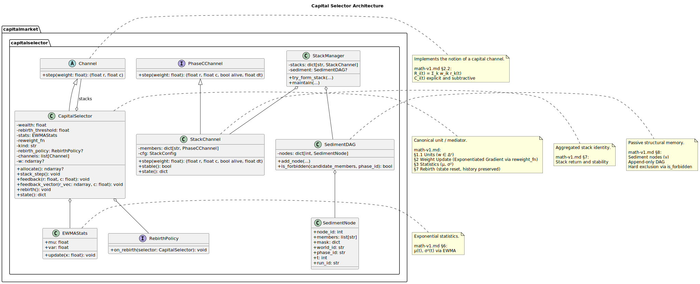
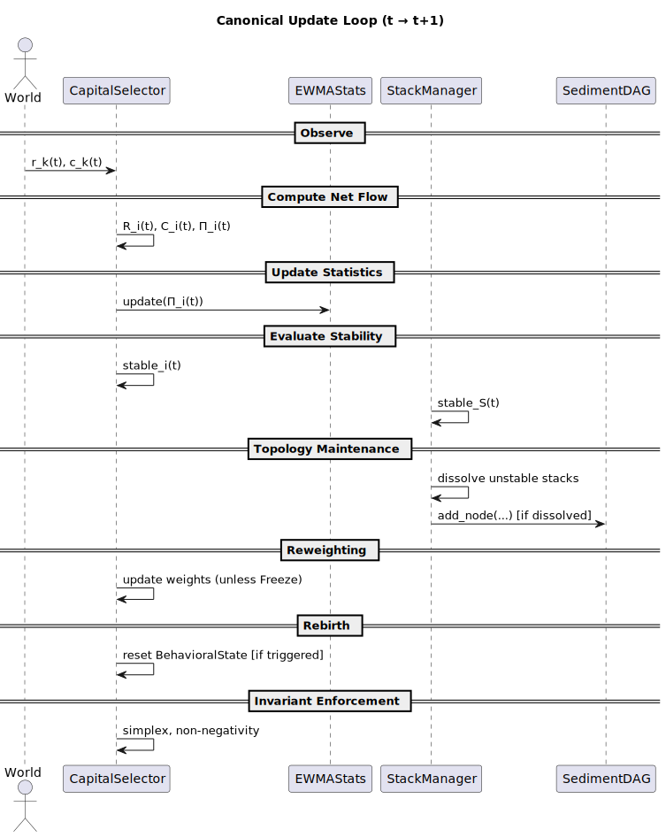

# Architecture Overview

This document maps the concrete Python implementation
to the canonical mathematical specification in `math-v1.md`.

It defines the **system boundary**, **state ownership**, **update semantics**,
and the **external control surface** (world, curriculum, modes).

Canonical document list: `canonical.md`.

---

## Runtime
- OS: Ubuntu 24.04
- Docker: NVIDIA Container Toolkit
- CUDA: 13.1
- PyTorch: 2.9.1+cu130

## Workflow
- Build: make build-{cpu|gpu}
- Run: make run-{cpu|gpu}
- Jupyter: make run-{cpu|gpu}-jupyter
- Editor: VS Code Remote
- Connectivity: Tailscale + SSH

---

## 1. Core Abstractions

**Hinweis zur Vererbung:**  
`CapitalSelector` erbt bewusst von `Channel`.  
Damit werden Mediatoren, Stacks und Selektoren als **vollwertige Auszahlungs‑Kanäle** modelliert.

Die Unterscheidung zwischen primitiven und zusammengesetzten Kanälen ist **verhaltensbezogen**, nicht ontologisch:
- **Primitive Kanäle:** keine Lernlogik, keine interne Mediation
- **Komposite Kanäle:** interner Zustand, Mediation, Inhibition

Externe Komponenten (World, Curriculum) interagieren **einheitlich** über die `Channel`‑Schnittstelle.

---

## 2. Mapping to Mathematical Sections

- Channel → math-v1 §2.2
- CapitalSelector → §2–§4, §6
- EWMAStats → §6
- Stack / StackManager → §7
- SedimentDAG → §8
- Rebirth → §9
- Freeze → §10

---

## 3. Explicit Non-Goals

- No emergent stacks without explicit `Stack` abstraction
- No neuron typing
- No hard sparsity thresholds
- No semantic interpretation of channels
- No adaptive teacher intervention on internal state

---

## 4. Architekturentscheidungen (fest)

These decisions are **architectural** (fixed once) and implemented consistently.
Reference: `math-v1.md` §16 / §17.

### D2 – Kanal-Ontologie
**Decision:** D2.A – semantikfreie Renditequellen  
Channels are pure payout functions `(r, c)` without identity or lifecycle.

---

### D4 – ETF-Baseline
**Decision:** D4.A – optional  
Baseline is an observability artifact, not part of the core dynamics.

---

### D10 – Rebirth Reset Scope
**Decision:** D10.A – Minimal Reset  

Reset scope:
- Weights `w_i`
- Central statistics `(μ_i, σ_i², DD_i)`

Not reset:
- Sediment (irreversible exclusion history)
- Topology (Stacks, Channels)
- Environment

Rebirth produces **behavioral variants under fixed environment**.

---

### D12 – Negative Equity
**Decision:** D12.B – Hard Clamp  
Equity is clamped to `E_i ≥ 0` after each step.

---

## 5. Canonical Update Loop

The system evolves in **discrete deterministic steps**.
A single step `t → t+1` follows this exact order:

1. **Observe**
   - Read channel returns `r_k(t)`

2. **Compute Net Flow**
   - Compute `R_i(t)`, `C_i(t)`, `Π_i(t)`

3. **Update Statistics**
   - EWMA mean and variance
   - Drawdown

4. **Evaluate Stability**
   - Unit stability
   - Stack stability

5. **Topology Maintenance**
   - Stack dissolution
   - Sediment insertion (unless Freeze)

6. **Reweighting**
   - Update weights (unless Freeze)

7. **Rebirth**
   - Reset BehavioralState if triggered

8. **Invariant Enforcement**
   - Simplex normalization
   - Non-negativity (wealth / equity)
   - Deterministic clipping

**Rationale:**  
Rebirth creates a *new behavioral variant*.  
Invariants are enforced **after Rebirth** to guarantee well-defined initial
conditions for the next step.

---

## 6. State Ownership & Causality

### BehavioralState (causal)
Owned by:
- Unit / CapitalSelector

Contains:
- Weights
- Statistics

Fully resettable via Rebirth.

---

### SedimentDAG (non-causal, structural)

- Append-only exclusion history
- No dynamic influence on learning, weights, or statistics
- **Structural filter** for future stack formation only

**Clarification:**  
Sediment has **no causal role in the system dynamics**.
It acts exclusively as a **topological exclusion memory**:
previously dissolved member/phase combinations cannot be re-formed.

Sediment has no causal influence on:
- weight updates
- statistics updates
- wealth or capital dynamics

Its sole effect is a structural exclusion during stack formation.

---

### Topology (Stacks)
- Constructed dynamically
- Dissolved on instability
- Never modified directly by curriculum or teacher

---

## 7. Compute Architecture & toCuda()

### 7.1 Layers

- **Spec Layer (Python State)**
  - Canonical semantics
  - Dataclasses / plain Python

- **Compute Layer (CPU)**
  - NumPy reference implementation
  - Deterministic

- **Compute Layer (GPU)**
  - PyTorch backend
  - Identical semantics

---

### 7.2 toCuda() Contract

`toCuda()` performs a **representation change only**.

- Input: deterministic Python state
- Output: tensor state on target device
- Invariants:
  - Simplex preserved
  - Non-negativity preserved
  - Shapes consistent
- No logic change
- Deterministic equivalence to CPU within defined tolerance

---

### 7.3 Determinism

- Fixed seeds in test mode
- Explicit numeric tolerances
- CPU reference must reproduce GPU results within tolerance

---

## 8. External Interface (System Boundary)

For the full external interface specification, see `interface.md`.

Empirical runs are defined **outside** the kernel:
World/Curriculum define experiments and must remain state-agnostic.
They may not receive internal state or provide control signals.

### 8.1 World

The **World** defines:
- Channel return processes
- Cost processes
- Exogenous randomness

Worlds are:
- Stateless or stateful
- Observable but **non-intervening**

---

### 8.2 Curriculum

A **Curriculum** defines a sequence of worlds or parameters.

Allowed:
- Changing return distributions
- Changing cost structures
- Changing channel counts
- Parameter-adaptive schedules

Not allowed:
- Direct state intervention
- Manipulation of weights, stats, topology
- Feedback from internal state into curriculum decisions

**Clarification:**  
Curricula may be *parameter-adaptive* but must remain **state-agnostic**.

---

### 8.3 Teacher

A Teacher may:
- Select curriculum
- Choose profile (A/B)
- Configure runtime parameters

A Teacher may **not**:
- Modify internal state
- Override stability decisions
- Inject signals into learning dynamics

---

## 9. Freeze Mode (Profile-dependent)

Freeze semantics are **profile-bound**.

### Profile A – Canonical (v1)
Freeze implies:
- No weight updates
- No statistics updates
- No topology changes
- No sediment insertion

**Invariant:**  
The complete internal state remains constant.
Random number generator state must either be frozen
or excluded from equality checks in tests.

---

### Profile B – Analytical / Research
Freeze may optionally:
- Freeze weights only
- Allow continued statistics updates

Constraint:
- No sediment or topology changes
- Deviations must be explicit and documented

---

## 10. Configuration & Profiles

The system does **not** expose a combinatorial configuration space.

Instead, it defines **internally consistent profiles**:

- **Profile A – Canonical Inhibition Mode**
  - Required for v1 / Prod-v0
- **Profile B – Analytical / Research Mode**
  - Optional, non-canonical

Implementations must support **Profile A** fully.

**Builder boundary (profile isolation):**
Profile selection occurs **only at instantiation** (builder time).
The canonical kernel remains profile-agnostic and must not contain
profile-conditional branches.

---

## 11. Implementation Delta (Summary)

Not yet implemented:
- Activity degree (§5 math)
- Statistics on net flow + drawdown
- BehavioralState reset
- Freeze logic
- Capital structure (§11–14 math)

Next step:
- Implementation specification with acceptance tests per section

---

## A. Interface Clarifications (Channels)

The system uses **two channel interfaces** with distinct roles:

- **Channel (core):** semantikfreie Auszahlung `(r, c)`; used by `CapitalSelector` composition.  
- **PhaseCChannel (brokered):** extends `(r, c)` with `(alive, dt)` for Phase‑C credit logic.
  - **Note:** `dt` is channel‑internal; the World does not provide `dt` in v1.

`CapitalSelector` is itself a `Channel`, so composites and primitives are uniform at the interface level.

---

## B. Sediment Causality Scope (Precision)

Sediment is **non‑causal** with respect to:
- Reweighting updates
- Statistics updates
- Wealth dynamics

Its only effect is a **structural filter** during stack formation (exclusion rule).

---

## C. Update‑Loop ↔ Code Mapping (Informal)

- **Observe:** `Channel.step`, `PhaseCChannel.step`  
- **Compute Net Flow:** `CapitalSelector.feedback` / `feedback_vector`  
- **Update Statistics:** `EWMAStats.update`, `StackChannel` internal stats  
- **Evaluate Stability:** `StackChannel.stable`  
- **Topology Maintenance:** `StackManager.maintain`, `StackManager.try_form_stack`  
- **Reweighting:** `reweight.exp_reweight` via `CapitalSelector.reweight_fn`  
- **Rebirth:** `CapitalSelector.rebirth`  
